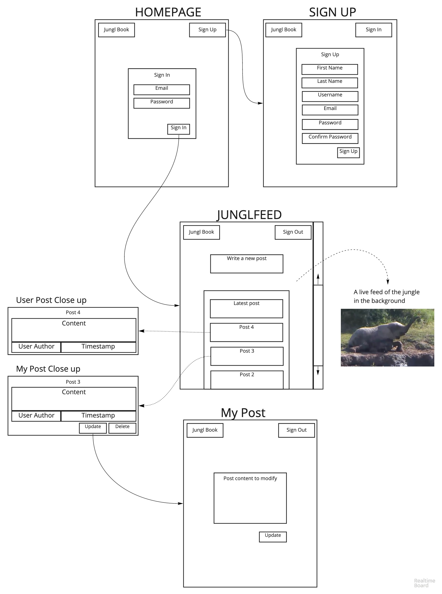

# Jungl-Book by Simian-Sinister

* Jungl-Book comes from a challenge to make a Facebook like  minimalist website. The challenge was to work efficiently in a new team using the Agile project management SCRUM framework for the first time. We used test driven development to create a web-application on Ruby on Rails.    

* As a team, for this project, we decided to focus on our processes and practising agile development. This was a steep learning curve due to the use of a new technology. We completed our first week using a 'spike' method to get a better understanding of the tech. We followed this up with a regimented agile TDD approach - [click here](https://github.com/simian-sinister/Acebook-Simian-Sinister/wiki) for our learning documentation.

-----
## **User Stories:**

```
As a new user,
So I can access Jungle-Book,
I want to be able to register.
```

```
As a registered user,
So I can view my JunglFeed,
I want to be able to sign in with my unique email and password.
```

```
As a signed-in user,
So I can securely exit my JunglFeed,
I want to be able to sign out.
```

```
As a signed-in user,
So I can view all posts after sign in,
I want to be redirected to my JunglFeed.
```

```
As a signed-in user,
So I can share my JunglLyf,
I would like to create a new post.
```

```
As a signed-in user,
So I can modify my posts,
I want to be able to update my posts.
```

```
As a signed-in user,
So I can clear my Jungl history,
I want to be able to delete my posts.
```

```
As a signed-in user,
So I can understand the context of a post,
I want to see the time it was posted.
```

```
As a signed-in user,
So I can see the latest updates with ease,
I want to see the newest posts first.
```
## Added user stories
```
As a signed-in user,
So other users can see my photos,
I want to be able to upload photos

As a signed-in user,
So I can store all my photos in one place,
I want to be able to upload photos to my album

As a signed-in user,
So I can customise my profile picture,
I want to be able to upload a profile picture

As a signed-in user,
so I can give context to my photos,
I want to be able to add a description

As a signed-in user,
So I can manage my privacy,
I want to be able to delete my photos

As a signed-in user,
So I can see what my friends are up to
I want to be able to see other users' albums

As a signed-in user,
So I can correct my photos' descriptions
I want to be able to edit my photo's descriptions

```


## Original wireframe

Overview:



## Quickstart

First, clone this repository. Then:

```bash
> bundle install
> bin/rails db:create
> bin/rails db:migrate

> bundle exec rspec # Run the tests to ensure it works
> bin/rails server # Start the server at localhost:3000
```

## Database migration

- [Link to our database setup and migration guide](https://github.com/simian-sinister/Acebook-Simian-Sinister/blob/master/db/schema.rb)
